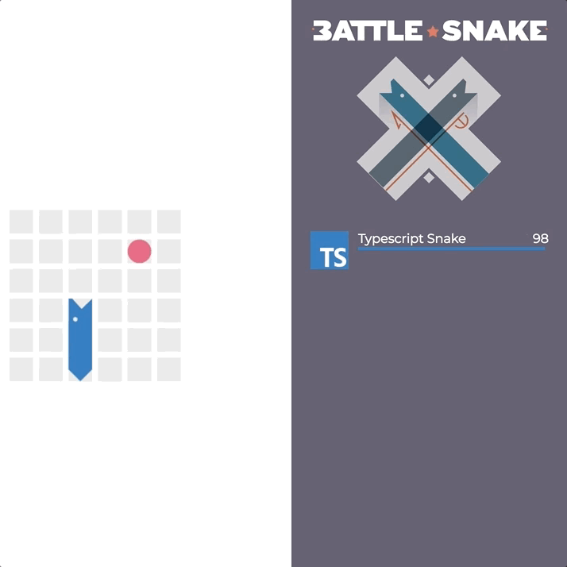

# Snake Battle Challenge
We'd like to test out your creative prowess. Create an algorithm that can decide on where should a snake move depending on the world around it. Let's see how long it can survive.


BattleSnake is an adaptation of the classic video game "Snake", where the player
maneuvers a snake around the game board to collect food pellets, which makes the
snake grow longer. The main objective is to collect as much food as as possible
while avoiding obstacles like walls and snakes' body.

# Rules
#### Avoid Walls

If a snake leaves the last tile of the board, they will die.


#### Eat Food
Eating a food pellet will make snakes one segment longer. Snakes grow out of
their tail: new tail segment will appear in the same square that the tail was in
the previous turn.

Eating a food pellet will restore snakes' health-points to 100.

The amount of food can vary from game to game, but within the same game it will
always stay the same. As soon as a piece of food is eaten, it will respawn at a
random, unoccupied location on the next turn.



#### Don't Starve
Every turn snakes will loose one health-point. In BattleSnake health-points
serve like the snake's hunger bar, and if it reaches zero, the snake will starve
and die. Eating food will restore snake's health to one-hundred points on the
next turn.


#### Don't Collide with Snakes' Tails

If a snake collides with itself or any other snakes' tails, it dies.


#### Head on Collisions

Head-to-head collisions follow different rules than the previously mentioned
tail collisions.

In head-on collisions, the longer snake will survive.


But if both snakes are the same size, they both die. Note that in the below
scenario, the food remains (collisions are resolved before food is eaten).


## Declaring a dependency on Snake AI FrameWork:
### Maven:
If you're using Maven for dependency management. Make sure you have the idalko artifactory listed in the repositories section:
```xml
<repositories>
        <repository>
            <releases>
                <enabled>true</enabled>
                <updatePolicy>always</updatePolicy>
                <checksumPolicy>warn</checksumPolicy>
            </releases>
            <id>iDalko</id>
            <name>iDalko Artifactory libs-release</name>
            <url>https://artifactory.idalko.com/artifactory/libs-release/</url>
            <layout>default</layout>
        </repository>
</repositories>
```
You're also going to need the dependency on the Snake AI FrameWork:
```xml
<dependencies>
    <dependency>
        <groupId>com.idalko.battle_snake</groupId>
        <artifactId>fw_2.13</artifactId>
        <version>0.7.0</version> <!-- if you find later versions, feel free to use them -->
    </dependency>
</dependencies>
```
### Sbt:
If you're using SBT, you should add a resolver for iDalko repository:
```sbtshell
resolvers += "Artifactory Libs Release" at "https://artifactory.idalko.com/artifactory/libs-release"
``` 
And then a library dependency on the framework itself:
```sbtshell
libraryDependencies += "com.idalko.battle_snake" % "fw_2.13" % "0.7.0"
```
### Gradle
In case if you prefer Gradle:
```groovy
repositories {
    mavenCentral()
    maven {
        url "https://artifactory.idalko.com/artifactory/libs-release"
    }
}
dependencies {
    implementation 'com.idalko.battle_snake:fw_2.13:0.7.0' //compile(group: 'com.idalko.battle_snake', name: 'fw_2.13', version: '0.7.0')
}
```

## Creating a snake AI
implement the interface `com.idalko.battle_snake.fw.api.ai.IAi`:
1. implement `@Nonnull IStartResponse getStartResponse(@Nonnull IStartRequest startRequest);` from `com.idalko.battle_snake.fw.api.ai.IAi`
which would provide info about your snake bot
2. implement `@Nonnull IMoveResponse makeMove(@Nonnull IMoveRequest moveRequest);`
note: any invocation of `makeMove` should take no longer than 200 ms to complete

## Testing the AI out
Use `com.idalko.battle_snake.fw.api.server.SnakeAiServer.start(IAi ai)` in your `public static void main` method.
It should produce output like this:
```
[2020-12-08 10:58:34,068] [INFO] [akka.event.slf4j.Slf4jLogger] [BattleSnakeAiFramework-akka.actor.default-dispatcher-3] [] - Slf4jLogger started
[2020-12-08 10:58:35,328] [INFO] [com.idalko.battle_snake.fw.api.server.SnakeAiServer$] [BattleSnakeAiFramework-akka.actor.default-dispatcher-8] [] - #startHttpServer Server online at http://127.0.0.1:9000/
```
This means that your AI is ready on `http://localhost:9000`, now all you need to do is to make it publicly available.
Use one of the tunnelling services like [ngrok](https://ngrok.com/) or [localtunnel](https://localtunnel.github.io/www/) to make sure your localhost:9000 can be accessed from any point in the world.
### ngrok
If you'd decided to use and installed ngrok, then you'd run:
```bash
ngrok http 9000
```
which would produce:
```text
ngrok by @inconshreveable                                                                                                                                                                                                     (Ctrl+C to quit)
                                                                                                                                                                                                                                              
Session Status                online                                                                                                                                                                                                          
Account                       XXX (Plan: Free)                                                                                                                                                                                         
Update                        update available (version 2.3.35, Ctrl-U to update)                                                                                                                                                             
Version                       2.3.34                                                                                                                                                                                                          
Region                        United States (us)                                                                                                                                                                                              
Web Interface                 http://127.0.0.1:4040                                                                                                                                                                                           
Forwarding                    http://44a2fbb17000.ngrok.io -> http://localhost:9000                                                                                                                                                           
Forwarding                    https://44a2fbb17000.ngrok.io -> http://localhost:9000                                                                                                                                                          
                                                                                                                                                                                                                                              
Connections                   ttl     opn     rt1     rt5     p50     p90                                                                                                                                                                     
                              6       0       0.00    0.00    5.20    6.13                                                                                                                                                                    
                                                                                                                                                                                                                                              
HTTP Requests                                                                                                                                                                                                                                 
-------------                                                                                                                                                                                                                                 
```  
This means that now if you navigate to `https://44a2fbb17000.ngrok.io` (note, that most probably you'd have a different URL) you'd see the same as what you see on [localhost:9000](http://localhost:9000)

Now head over to [battlesnake.exalate.st](https://battlesnake.exalate.st)
\

\
\
Click "New game"
\

\
\
Insert your `https://44a2fbb17000.ngrok.io` into the form and click "Create game"
Now click the show link at the bottom:
\

\
\
Feel free to click the play button to start the game.